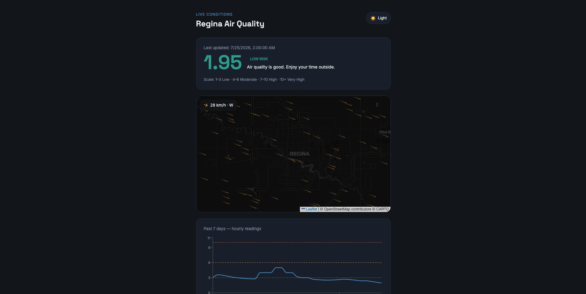

# Regina Air Quality Tracker

A live dashboard showing air quality and wind conditions for Regina, Saskatchewan. Built with a FastAPI backend pulling from Environment Canada's public AQHI feed and an Open-Meteo wind API, and a React frontend with an animated wind particle map.



**Live site:** https://agent-6a6668d63416d238da5ae347--yqrair.netlify.app/

---

## Background

Environment Canada publishes Air Quality Health Index (AQHI) data publicly, but it's raw JSON buried in a government API — not something a regular person would find or know how to read. This project pulls that data for Regina specifically, pairs it with live wind conditions, and presents it in a way that's actually useful: a plain-English health advisory, a 7-day history chart, and an animated map showing which way the wind is blowing right now.

I built this to practice working with real open data sources and to get comfortable building a full Python + React stack from scratch.

---

## What it does

- Fetches the current AQHI reading for Regina from Environment Canada and translates the number into a plain-English health advisory (good / moderate / high / very high)
- Displays a 7-day hourly history chart of AQHI readings
- Shows an animated wind map of Regina — gold particle streaks flowing in the live wind direction, speed-scaled to the actual wind data
- Light and dark theme toggle, including a matching basemap swap (dark CartoDB tiles in dark mode, light tiles in light mode)
- Logs each AQHI reading to a local SQLite database so the history chart fills in over time, beyond the short window Environment Canada's feed retains

---

## Tech stack

| Layer | Tech |
|---|---|
| Backend | Python, FastAPI, httpx |
| Database | SQLite (local history logging) |
| Frontend | React, Vite |
| Charts | Recharts |
| Map | Leaflet, react-leaflet |
| Map tiles | CartoDB (dark + light) |
| AQHI data | Environment Canada open API |
| Wind data | Open-Meteo (free, no key required) |

---

## Project structure

```
regina-air-quality/
├── backend/
│   ├── main.py          # FastAPI app — AQHI, wind, history endpoints
│   ├── requirements.txt
│   └── Procfile         # Railway start command
└── frontend/
    ├── index.html
    ├── package.json
    ├── vite.config.js
    └── src/
        ├── App.jsx          # Root component, data fetching, theme state
        ├── AQHICard.jsx     # Current reading card with health advice
        ├── HistoryChart.jsx # 7-day line chart (Recharts)
        ├── WindMap.jsx      # Leaflet map + canvas particle animation
        ├── main.jsx
        └── index.css        # CSS custom properties for dark/light theme
```

---

## Running locally

**Backend**

```bash
cd backend
python3 -m venv venv
source venv/bin/activate
pip install -r requirements.txt
uvicorn main:app --reload
```

Runs on `http://localhost:8000`. Test endpoints:
- `/api/current` — live AQHI reading for Regina
- `/api/history` — last 7 days of hourly readings
- `/api/wind` — live wind speed and direction

**Frontend**

```bash
cd frontend
npm install
npm run dev
```

Runs on `http://localhost:5173`. Expects the backend on `localhost:8000`.

**Running both at once**

```bash
./start.sh
```

---

## How the history chart works

Environment Canada's AQHI realtime feed only keeps a short rolling window — not a guaranteed full 7 days. The backend works around this by logging every reading it fetches into a local SQLite file (`history.db`). When `/api/history` is called, it merges the government feed's current window with everything in the local log, then returns up to 168 hours (7 days) of readings sorted by time. The chart fills in more completely the longer the backend stays running.

---

## How the wind animation works

The map uses a `<canvas>` element layered on top of a Leaflet map via an absolute-positioned overlay. Each frame, the canvas is fully cleared with `clearRect` (not a semi-transparent fill — that was causing the map tiles to darken progressively). Seventy particles move across the canvas in the direction the wind is actually blowing, each trailing a fading line of up to 10 segments. When a particle crosses an edge, its trail is wiped so it doesn't draw a glitch line across the whole map. Wind direction comes from Open-Meteo's current weather endpoint using Regina's coordinates.

---

## Known limitations

- The wind map applies one wind reading uniformly across the whole city. A real gridded wind field would require pulling forecast model data (e.g. Environment Canada's HRDPS or NOAA's GFS) — a meaningful next step but a much larger pipeline
- `history.db` doesn't persist across Railway redeploys on the free tier. Locally it builds up correctly across sessions. Fixing this properly would mean swapping SQLite for a persistent hosted database

---

## Possible next steps

- Pull a real wind vector grid instead of a single point reading
- Add a forecast tab using Environment Canada's AQHI forecast endpoint
- Swap SQLite for a persistent hosted Postgres database so history survives redeploys
- Browser push notifications when AQHI spikes above a threshold
- Progressive Web App (PWA) manifest so it can be installed on a phone's home screen
